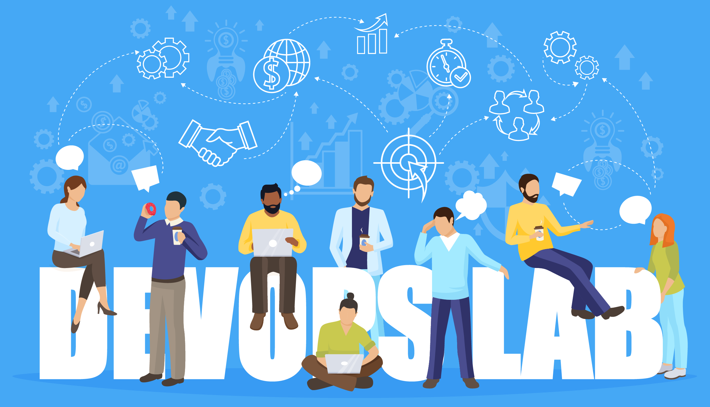

[Chinese Version Link](README.md)

# Sharing The Experience of <DevOps Capability Maturity Certification>

Our team started participating in the “DevOps Capability Maturity” certification work in 2019 and achieved some results while also identifying areas for improvement. The purpose of the text is to record the team’s participation in the rating process, including information related to documents, tools, processes, strengths, and weaknesses. The main goal is to share the problems encountered and solutions found during the certification process and to welcome contributions from others’ experiences. The hope is that this information can help other teams smoothly complete the certification work.

